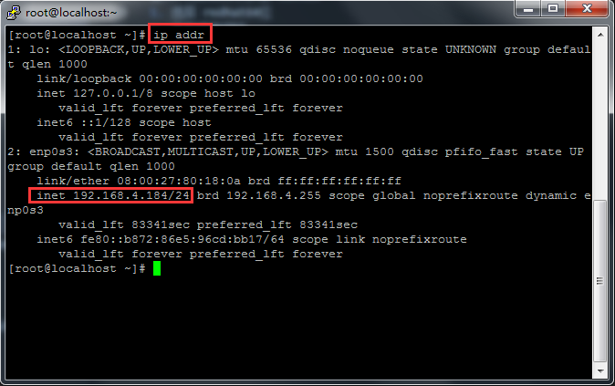
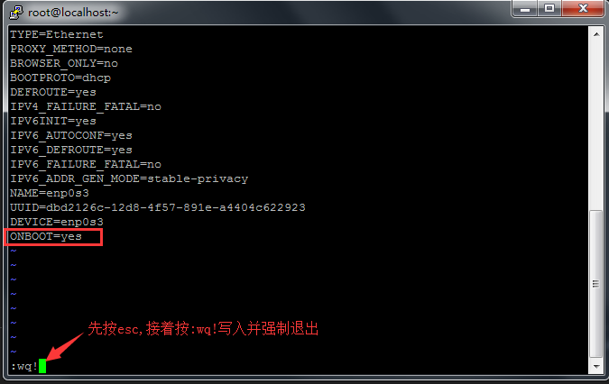
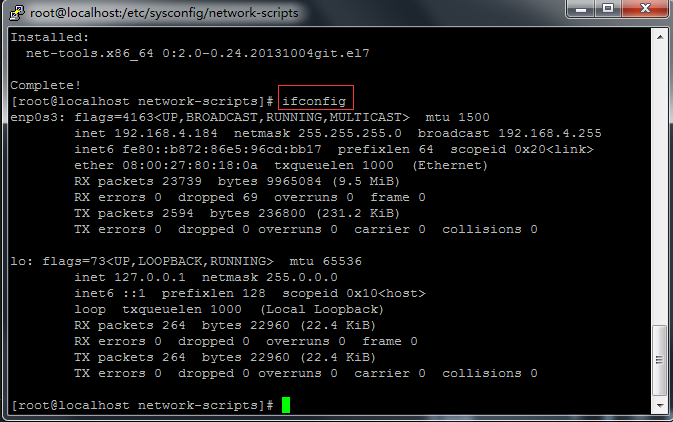
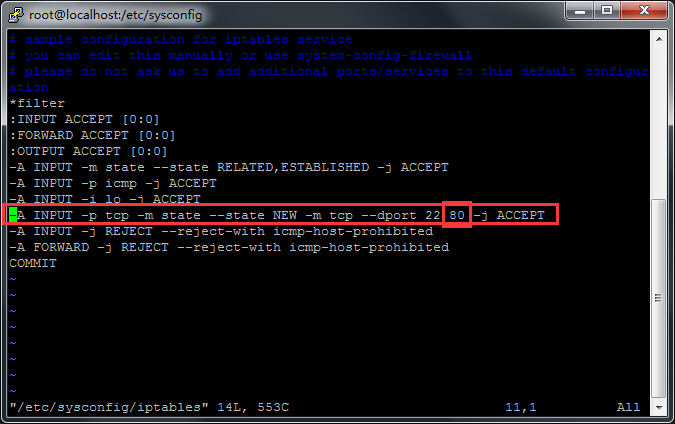

# Linux学习
## 常用命令
1. `cp a.txt b.txt` -复制文件
2. `mv a.txt c.txt` -一般用mv来重命名文件而不用rename,因为mv更简单
3. vi编辑文件时, 按i开始编辑, 按esc退出到命令行,再输入:wq! 强制退出并保存 w=write,q=quit,!=强制 :=行末
4. `su - soft01` -切换账户
5. 查看某个进程状态 `ps -ef |grep ssh`

## 安装centos
### 下载centos
[centos官网下载页](https://www.centos.org/download/)  
选择 DVDISO（目前版本7.6 - 2019-01）  
[163镜像地址](http://mirrors.163.com/centos/7.6.1810/isos/x86_64/CentOS-7-x86_64-DVD-1810.iso)  
[阿里云镜像地址](http://mirrors.aliyun.com/centos/7.6.1810/isos/x86_64/CentOS-7-x86_64-DVD-1810.iso)  
### 安装vitualbox
在virtualbox中安装 centos
1. 选择 redhat64位
2. 选择桥接网络
3. 选择最小安装，并设置root的密码

## centos的一些配置 
### 基础配置
+ 输入 `ip addr` 查看ip (如果这一步看不到ip,就先执行下面的 vi操作)  

+ 从上面的 `ip addr` 命令窗口中可以看到有个 enp0s3
  - `vi /etc/sysconfig/network-scripts/ifcfg-enp0s3` 打开后按 i 进入插入模式 编辑之后按下esc 并输入:wq!保存并退出  
  
  - 将网络重启 `service network restart` 此时再 用`ip addr`可以看到 enp0s3有ip了
+ 为了方便使用 `ifconfig` 命令,安装 `net-tools`插件, 执行 `yum install net-tools`
+ 安装完成后再输入 `ifconfig`  

+ 查看 linux版本 `cat /etc/redhat-release` 
+ linux 下载文件的时候经常使用wget,所以也先进行安装 `yum install wget`

### 替换默认源
http://mirrors.163.com/.help/centos.html 这是163的镜像源(此处使用163的),  阿里的镜像源: https://opsx.alibaba.com/mirror
1. 根据上面网址的提示，先备份 `mv /etc/yum.repos.d/CentOS-Base.repo /etc/yum.repos.d/CentOS-Base.repo.backup`
2. 接着进入到 /etc/yum.repos.d/ 目录,也就是上面要备份文件的目录  `cd /etc/yum.repos.d/`
3. 仍然是根据网址的提示下载repo文件,此时就用到了wget `wget http://mirrors.163.com/.help/CentOS7-Base-163.repo`
4. 最后执行
```shell
yum clean all
yum makecache
```
5. 安装 vim `yum install vim`

### SSH
1. 如果服务器没有安装SSH  `yum install openssh-server`
2. 启动 `service sshd start`
3. 设置开机运行 `chkconfig sshd on`


### 防火墙
首先检查一下服务器是否安装了 firewall  `yum list |grep firewall`  
确认一下 firewall是否已经启动起来了 `ps -ef |grep firewall`
1. 安装：`yum install firewalld`
2. 启动：`service firewalld start`
3. 检查状态：`service firewalld status`
4. 关闭或禁用防火墙： `service firewalld stop/disable`
5. 命令： `firewall-cmd --version`

## nginx
### nginx安装
参考技术胖视频：http://jspang.com/post/nginx.html    [nginx官网](http://nginx.org/)
1. 前置安装
```shell
yum -y install gcc gcc-c++ autoconf pcre-devel make automake
yum -y install httpd-tools     # 因为上面已经安装了wget和vim所以这里仅安装httpd-tools
```
2. 配置nginx yum源 http://nginx.org/en/linux_packages.html#stable   
`vim /etc/yum.repos.d/nginx.repo`
```nginx
[nginx]
name=nginx repo
baseurl=http://nginx.org/packages/centos/7/$basearch/
gpgcheck=0
enabled=1
```
3. 上面操作完成后 `yum list | grep nginx` 可以看到有最新的 nginx yum源了，接下来安装
```shell
yum install nginx  # 安装过程中会有个询问 输入y
nginx -v           # 安装完成后查看版本
```

### nginx基础配置
1. 简单命令查看nginx大概安装在哪些目录 `rpm -ql nginx`
2. 开启nginx `nginx`
在上一步开启nginx之后,我尝试启动浏览器依然访问不了, 现在就要去设置防火墙允许80端口访问  
因为是虚拟机安装的mini centos, 默认是使用的firewall, 先把它停了,装iptable  [参考这里](https://www.cnblogs.com/songanwei/p/9239813.html)   
```shell
systemctl stop firewalld 
systemctl mask firewalld

yum install -y iptables 
yum install iptables-services

# 开启服务 
systemctl start iptables.service

systemctl restart iptables.service # 重启防火墙使配置生效 
systemctl enable iptables.service # 设置防火墙开机启动
```
接着编辑 /etc/sysconfig/iptables 增加 80 端口
```
vim /etc/sysconfig/iptables
```
    
如果是阿里云或腾讯云等云服务器，应在控制台开放80端口(默认一般是开启的)    
重启iptables服务
```shell
service iptables status    #查看iptables状态
service iptables restart   #iptables服务重启
# service iptables stop      #iptables服务禁用
```


