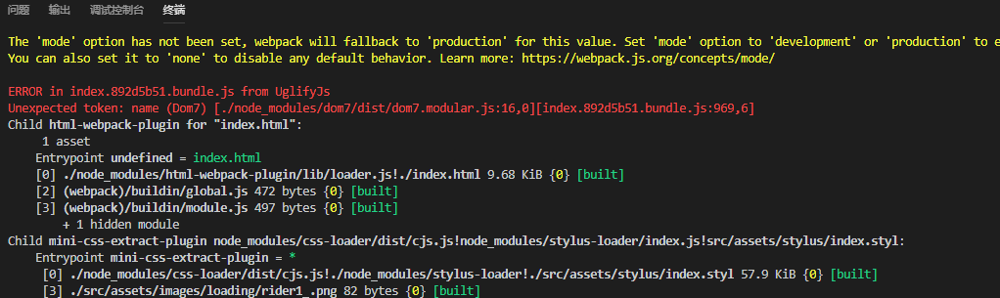

## 1. `yarn add swiper zepto`
## 2. 起先是想用js引入的方式直接写    
   还是练习一下webpack的使用以及ES6 import模块化加载的方式     
   `yarn add webpack webpack-cli`

## 3. 安装webpack的基本loader
`yarn add -D style-loader css-loader file-loader stylus stylus-loader url-loader`

## 4. 添加webpack.config.js并配置
```javascript
const path = require('path')

module.exports ={
    entry: {
        index: './src/index.js'
    },
    output: {
        filename: '[name].bundle.js',
        path: path.resolve(__dirname,'dist')
    },
    module: {
        rules:[
            {test: /\.css$/, use: ['style-loader','css-loader']}
        ]
    }
}
```

## 5. 安装 webpack的插件 (html-webpack-plugin和clean-webpack-plugin)
`yarn add -D html-webpack-plugin clean-webpack-plugin`

```javascript
在html中使用配置项的值
<%= htmlWebpackPlugin.options.title %>

const HtmlWebpackPlugin = require('html-webpack-plugin')
const CleanWebpackPlugin = require('clean-webpack-plugin')

plugins: [
        new CleanWebpackPlugin(['dist']),
        new HtmlWebpackPlugin({
            title: '首页',
            template: 'index.html'
        })
    ]
```

## 6. 使用ES6来写
+ 参考： [babel中文网](https://www.babeljs.cn/docs/setup/#installation)
+ `yarn add -D babel-core babel-loader`  --这种方式安装的bable-loader是8.x版本,而babel-core是6.x-对应的babel-loader需要@7版本
+ `npm uninstall babel-loader`  --先移除最新版，再安装@7版本
+ `yarn add -D babel-loader@7`       --上面安装的babel-core是6.x版本要使用7.x版本的babel-loader
+ 安装 preset
  + `yarn add -D babel-preset-env`
+ 配置webpack  module->rules
```
{ test: /\.js$/, exclude: /node_modules/, loader: "babel-loader" }

创建 .babelrc 配置文件
{
    "presets": ["env"]
}
```

## 7. 因为zepto不是commonjs规范, 在模块化使用时需要特殊处理
- 参考：https://blog.csdn.net/wzyxdwll/article/details/79492705
- https://blog.csdn.net/huang100qi/article/details/66971532

- `yarn add -D exports-loader script-loader`

webpack.config.js中需要配置如下 rules
```javascript
{
    test: require.resolve('zepto'),
    loader: 'exports-loader?window.Zepto!script-loader'
},
{
    test:/node_modules\/zepto\/src\/\*.js/,
    loader: 'exports-loader?!script-loader'
}

plugins:
new webpack.ProvidePlugin({
    $: 'zepto',
    Zepto: 'zepto'
}),
```

使用之处：
```javascript
import $ from 'zepto'
import zeptoEvent from 'zepto/src/event.js'
import zeptofx from 'zepto/src/fx.js'
import zeptofxMethod from 'zepto/src/fx_methods.js'
import zeptoTouch from 'zepto/src/touch.js'
```

## 8. package.json的scripts中添加打包脚本

`"build":"webpack --confg webpack.config.js"`

## 9. 配置webpack开发环境
+ webpack.config.js中开启sourcemap
  `devtool: 'inline-source-map',`
+ 安装 webpack-dev-server
  - `yarn add -D webpack-dev-server`
  - webpack.config.js中加入devServer的配置  hot:true是启用hotmodulereplacement
    ```javascript
    devServer: {
        contentBase: './dist',
        hot: true
    },
    ```
  - package.json中增加启动脚本    
    `"start": "webpack-dev-server --mode=development --open",`

## 10. 因为项目中用到了静态资源(mp3音乐文件)
直接用 copy-webpack-plugin 插件 把mp3文件复制到dist目录中    
安装：`yarn add -D copy-webpack-plugin`    
`webpack.config.js`中使用    
```js
const CopyWebpackPlugin = require('copy-webpack-plugin')

const config = {
  plugins: [
    new CopyWebpackPlugin([
        {
            from: path.resolve(__dirname, 'src/assets/music'),
            to: path.resolve(__dirname, 'dist/music') 
        }
    ])
  ]
}
```

## 11. 将样式打包到css文件中（而不是link引入的）
需要用到webpack的插件(webpack4.x之后的版本使用) `mini-css-extract-plugin` [github地址](https://github.com/webpack-contrib/mini-css-extract-plugin)
1. 安装  `yarn add -D mini-css-extract-plugin`
2. 在webpack.config.js文件中配置并使用
```js
const MiniCssExtractPlugin = require("mini-css-extract-plugin");      // 把样式打包成文件只在生产环境下使用
const devMode = process.env.NODE_ENV !== 'production'

module.exports = {
  plugins: [
    new MiniCssExtractPlugin({
      // Options similar to the same options in webpackOptions.output
      // both options are optional
      filename: devMode ? '[name].css' : '[name].[hash].css',
      chunkFilename: devMode ? '[id].css' : '[id].[hash].css',
    })
  ],
  module: {
    rules: [
        {test: /\.css$/, use: [
            devMode ? 'style-loader' : MiniCssExtractPlugin.loader,
            'css-loader'
        ]},
        {test: /\.styl$/, use: [
            devMode ? 'style-loader' : MiniCssExtractPlugin.loader,
            'css-loader','stylus-loader'
        ]}
    ]
  }
}
```
3. 上面的配置中要修改process.env.NODE_ENV的值为production,所以安装 cross_env   `yarn add -D cross-env` 参考：https://www.cnblogs.com/usebtf/p/9912413.html    
   接着 配置打包生产环境的脚本  `"build": "cross-env NODE_ENV=production webpack --config webpack.config.js"`
4. 执行 `npm run build`可以看到样式被单独打包到了一个 css中
5. 把所有的样式打包进一个样式文件中（经实践，我发现上面已经只有一个样式文件）,还是按文档来, 为 webpack.config.js增加
```js
optimization: {
    splitChunks: {
        cacheGroups: {
            styles: {
                name: 'styles',
                test: /\.css$|\.styl$/,
                chunks: 'all',
                enforce: true
            }
        }
    }
},
```
6. 上面虽然把样式打包到了一个样式文件中,但样式是没有压缩的, webpack4需要安装插件 `optimize-css-assets-webpack-plugin` js压缩使用 `uglifyjs-webpack-plugin`
`yarn add -D optimize-css-assets-webpack-plugin uglifyjs-webpack-plugin` 安装之后在`webpack.config.js`中使用
```javascript
const UglifyJsPlugin = require("uglifyjs-webpack-plugin")
const OptimizeCSSAssetsPlugin = require("optimize-css-assets-webpack-plugin")

optimization: {
    splitChunks: {
        cacheGroups: {
            styles: {
                name: 'styles',
                test: /\.css$|\.styl$/,
                chunks: 'all',
                enforce: true
            }
        }
    },
    minimizer: [
        new UglifyJsPlugin({
            cache: true,
            parallel: true,
            sourceMap: true // set to true if you want JS source maps
        }),
        new OptimizeCSSAssetsPlugin({})
    ]
},
```
经过上面的步骤,本以为大功告成了,npm run build打包的时候出错：   
     
通过网上的番搜索,大致的原因是  swiper4.x或者dom7中使用了es6的语法, 而uglify压缩js不能有es6语法,所以报错,解决办法就是将swiper和dom7先用babel-loader解析(变成了es5),       
然后再压缩就不会报错了, 修改 webpack.config.js
```javascript
// 一般的写法是这样的  {test: /\.js$/, exclude:/node_modules/, use: ['babel-loader']},
{test: /\.js$/, include:[path.resolve(__dirname,'src'),path.resolve(__dirname,'node_modules/swiper'),path.resolve(__dirname,'node_modules/dom7')], use: ['babel-loader']},
```
